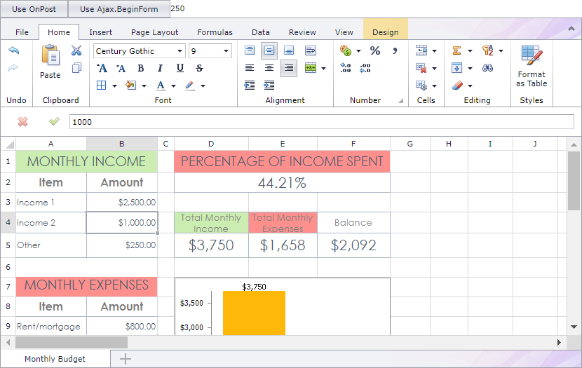

<!-- default badges list -->

<!-- default badges end -->
# Spreadsheet for ASP.NET MVC - How to send an AJAX request to the server to obtain cell values

This example demonstrates how to use AJAX methods to send a request to the server and obtain cell values.

You should update the Spreadsheet's state before you send a request to the server. To do this, use one of the following methods:

* Call the [Ajax.BeginForm](https://learn.microsoft.com/en-us/dotnet/api/system.web.mvc.ajax.ajaxextensions.beginform?view=aspnet-mvc-5.2) method to add the `<form>` tag to the response. The Spreadsheet located in this tag automatically updates its state when a user submits the form.

* Call an internal `OnPost` method to update the Spreadsheet state, then call the [Jquery.ajax](https://api.jquery.com/Jquery.ajax/) method to send a request. Note that we may change the name or implementation of the `OnPost` method in the future without notice.

## Files to Review

* [Index.cshtml](./CS/T318446/Views/Home/Index.cshtml)
* [HomeController.cs](./CS/T318446/Controllers/HomeController.cs) (VB: [HomeController.vb](./VB/T318446/Controllers/HomeController.vb))
* [_SpreadsheetPartial.cshtml](./CS/T318446/Views/Home/_SpreadsheetPartial.cshtml)

## Documentation

* [Office Document Management](https://docs.devexpress.com/AspNetMvc/402337/common-features/office-document-management)

## More Examples

- [How to save/load documents to/from a database](https://github.com/DevExpress-Examples/asp-net-mvc-spreadsheet-work-with-database)
